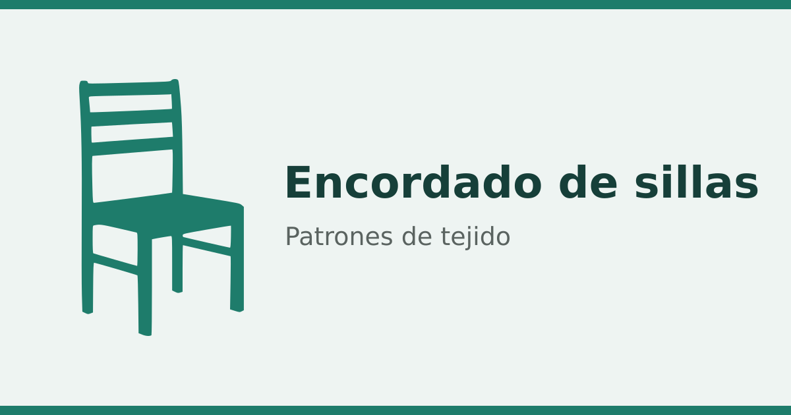

# Encordado de sillas

Aplicación web para diseñar patrones de encordado, tejido o cestería sobre una cuadrícula, y convertirlos en instrucciones fáciles de seguir, columna a columna, mientras se teje.

Está pensada para artesanos: primero dibujas el motivo y luego la app te dice, en cada columna, cuántos puntos van por encima y cuántos por debajo.

## Para qué sirve

- **Diseñar** un motivo sobre una cuadrícula, celda a celda o importando una imagen.
- **Tejer** siguiendo las instrucciones que genera la app para cada columna.
- **Guardar y compartir** el diseño como imagen o como enlace.

La aplicación tiene dos modos, que se cambian con las pestañas **Diseño** y **Tejer** de arriba.

## Cómo se usa

### 1. Diseña el patrón (modo Diseño)

1. Ajusta el tamaño de la cuadrícula con **Filas** y **Columnas**.
2. Con la herramienta **Pintar** marca las celdas; con **Borrar** las quitas. Puedes hacer clic o arrastrar.
3. Si te equivocas, usa **Deshacer** (o `Ctrl+Z`).

Herramientas que te ayudan a editar más rápido:

- **Seleccionar** y **Mover** un trozo del dibujo; al moverlo solo se desplaza lo pintado, sin tapar el fondo.
- **Copiar**, **Cortar** y **Pegar** una parte del patrón.
- **Zoom** y la mano para **desplazar** la vista cuando trabajas de cerca.

Si reduces el tamaño de la cuadrícula, lo que quede fuera **no se borra**: se conserva por si lo necesitas, y reaparece al volver a agrandarla.

#### Importar una imagen

Pulsa **Importar imagen** para convertir un dibujo (PNG, JPG o WebP) en celdas. Arrástrala para colocarla sobre la cuadrícula y pulsa **Fijar imagen** (o haz clic fuera, o pulsa Enter) para incorporarla al patrón. Con **Invertir lectura** cambias qué se considera pintado y qué vacío.

### 2. Sigue las instrucciones (modo Tejer)

1. Cambia a la pestaña **Tejer**.
2. Elige la **dirección** de lectura de cada columna: de arriba hacia abajo o de abajo hacia arriba.
3. Avanza con las flechas o tocando una columna; la columna actual se resalta.

Cada columna se traduce en una lista de números. Una celda pintada significa **por encima** y una celda vacía significa **por debajo**:

- **Caja rellena**: tantos puntos seguidos **por encima**.
- **Caja vacía**: tantos puntos seguidos **por debajo**.
- **Número**: cuántas celdas seguidas tiene ese tramo.

Así, en lugar de contar celda a celda, sigues una secuencia corta de números por columna.

## Guardar y compartir

- **Exportar diseño PNG**: descarga el patrón como imagen.
- **Copiar enlace del diseño**: genera un enlace que contiene todo el patrón y su configuración. Quien lo abra verá tu diseño tal cual; también te sirve para guardarlo tú.

## Instalar y usar sin conexión

La aplicación se puede **instalar** como una app más (desde el navegador, opción «Instalar» o «Añadir a la pantalla de inicio») y funciona **sin conexión** una vez abierta la primera vez.
